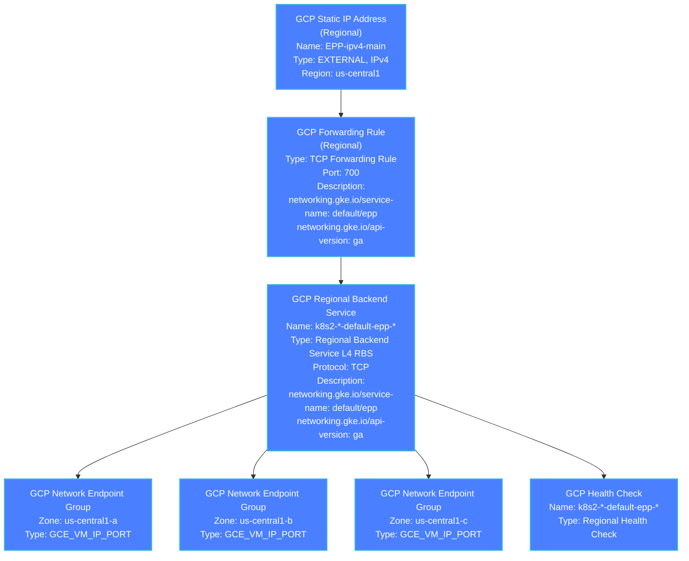
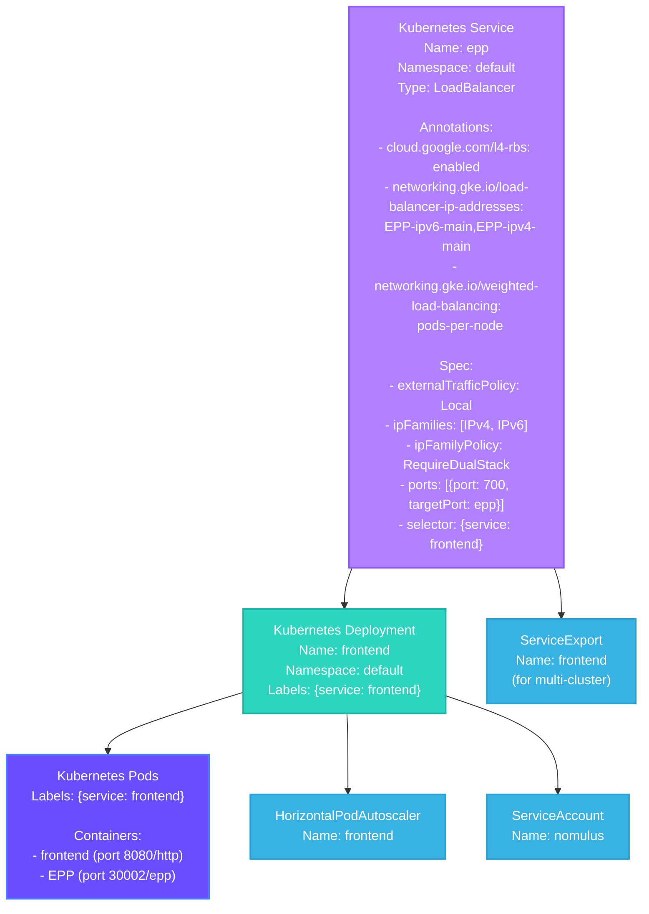
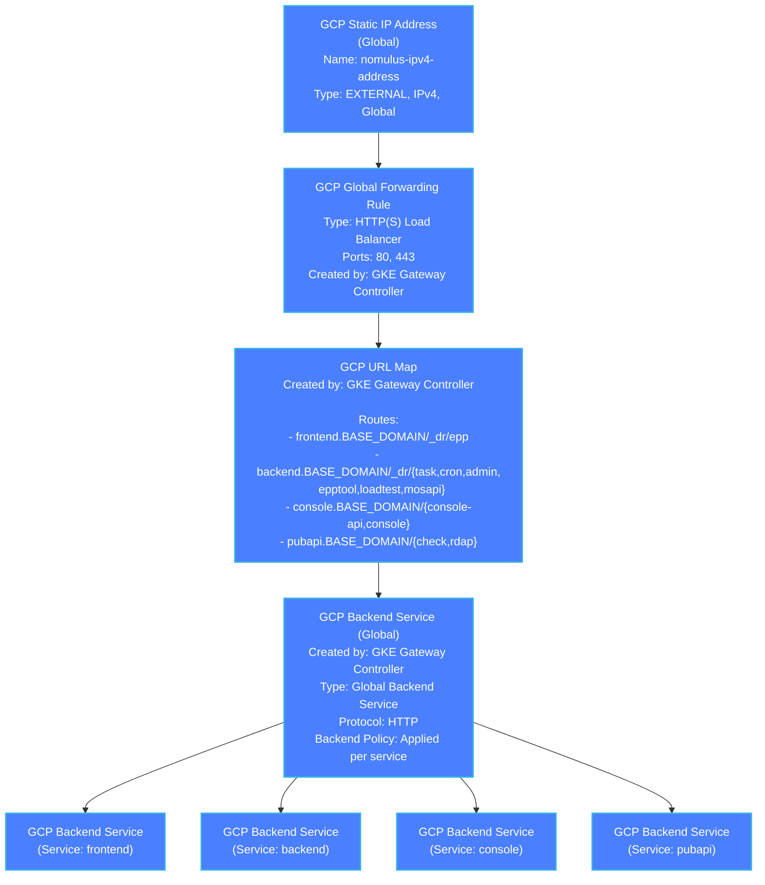
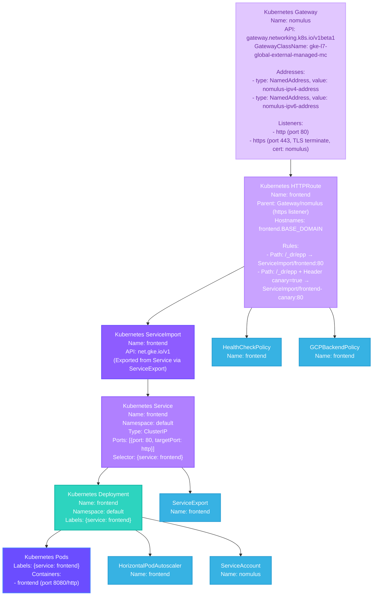
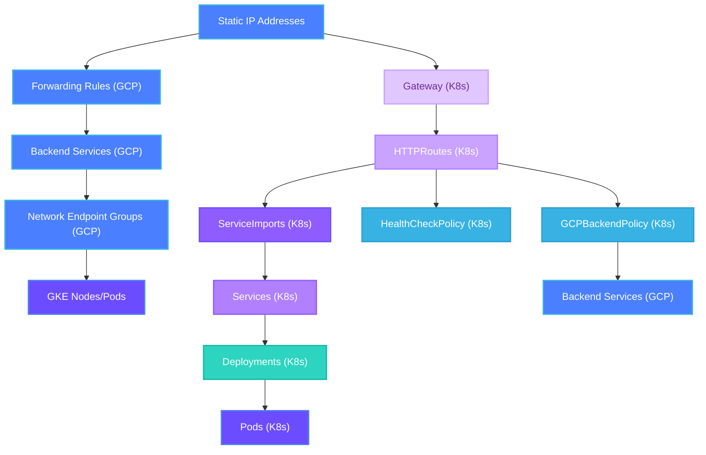

# Kubernetes and GCP Resource Map

This document maps all Kubernetes and GCP resources in the Nomulus deployment architecture.

## Architecture Overview

The Nomulus deployment uses two main networking paths:
1. **L4 Load Balancer (Regional)** - For EPP service (TCP port 700)
2. **L7 Global Load Balancer (Gateway API)** - For HTTP/HTTPS services (frontend, backend, console, pubapi)

---

## Complete Architecture Diagram

See [gke-complete-architecture.mermaid](./gke-complete-architecture.mermaid) for the complete architecture diagram.

---

## 1. EPP Service - L4 Regional Load Balancer Path

### GCP Resources (Regional - us-central1)

### Kubernetes Resources

---

## 2. HTTP Services - L7 Global Load Balancer Path (Gateway API)

### GCP Resources (Global)

### Kubernetes Resources

### Additional Gateway Routes

**Backend Service Route:**
- HTTPRoute: `backend`
- Hostname: `backend.BASE_DOMAIN`
- Paths: `/_dr/task`, `/_dr/cron`, `/_dr/admin`, `/_dr/epptool`, `/_dr/loadtest`, `/_dr/mosapi`
- Targets: ServiceImport/backend:80 (with canary support)

**Console Service Route:**
- HTTPRoute: `console`
- Hostname: `console.BASE_DOMAIN`
- Paths: `/console-api`, `/console`
- Targets: ServiceImport/console:80 (with canary support)

**PubAPI Service Route:**
- HTTPRoute: `pubapi`
- Hostname: `pubapi.BASE_DOMAIN`
- Paths: `/check`, `/rdap`
- Targets: ServiceImport/pubapi:80 (with canary support)

---

## 3. Service-Specific Resources

### Frontend Service
- **Kubernetes Resources:**
  - Deployment: `frontend`
  - Service: `frontend` (ClusterIP)
  - Service: `epp` (LoadBalancer - L4)
  - ServiceExport: `frontend`
  - HorizontalPodAutoscaler: `frontend`
  - HTTPRoute: `frontend`
  - HealthCheckPolicy: `frontend`, `frontend-canary`
  - GCPBackendPolicy: `frontend`, `frontend-canary`

### Backend Service
- **Kubernetes Resources:**
  - Deployment: `backend`
  - Service: `backend` (ClusterIP)
  - ServiceExport: `backend`
  - HorizontalPodAutoscaler: `backend`
  - HTTPRoute: `backend`
  - HealthCheckPolicy: `backend`, `backend-canary`
  - GCPBackendPolicy: `backend`, `backend-canary`

### Console Service
- **Kubernetes Resources:**
  - Deployment: `console`
  - Service: `console` (ClusterIP)
  - ServiceExport: `console`
  - HorizontalPodAutoscaler: `console`
  - HTTPRoute: `console`
  - HealthCheckPolicy: `console`, `console-canary`
  - GCPBackendPolicy: `console`, `console-canary`

### PubAPI Service
- **Kubernetes Resources:**
  - Deployment: `pubapi`
  - Service: `pubapi` (ClusterIP)
  - ServiceExport: `pubapi`
  - HorizontalPodAutoscaler: `pubapi`
  - HTTPRoute: `pubapi`
  - HealthCheckPolicy: `pubapi`, `pubapi-canary`
  - GCPBackendPolicy: `pubapi`, `pubapi-canary`

---

## 4. Canary Deployments

Each service has a canary variant:
- Deployment: `{service}-canary`
- Service: `{service}-canary` (ClusterIP)
- ServiceExport: `{service}-canary`
- HTTPRoute: Routes with `canary=true` header → canary ServiceImport
- HealthCheckPolicy: `{service}-canary`
- GCPBackendPolicy: `{service}-canary`

---

## 5. Required GCP Static IP Addresses

### Regional IPs (for L4 Load Balancer)
1. **EPP-ipv4-main** (us-central1, IPv4)
2. **EPP-ipv6-main** (us-central1, IPv6)

### Global IPs (for L7 Load Balancer)
1. **nomulus-ipv4-address** (global, IPv4)
2. **nomulus-ipv6-address** (global, IPv6)

---

## 6. Resource Naming Conventions

### GCP Resources (Auto-generated by GKE)
- Forwarding Rules: `k8s2-<cluster-hash>-<namespace>-<service>-<hash>`
- Backend Services: `k8s2-<cluster-hash>-<namespace>-<service>-<hash>`
- Network Endpoint Groups: `k8s2-<cluster-hash>-<namespace>-<service>-<hash>`
- Health Checks: `k8s2-<cluster-hash>-<namespace>-<service>-<hash>`

### Kubernetes Resources (Defined in Manifests)
- Deployments: `{service}`, `{service}-canary`
- Services: `{service}`, `{service}-canary`, `epp`
- HTTPRoutes: `{service}` (frontend, backend, console, pubapi)
- Gateway: `nomulus`
- ServiceExports: `{service}`, `{service}-canary`
- HealthCheckPolicy: `{service}`, `{service}-canary`
- GCPBackendPolicy: `{service}`, `{service}-canary` (generated from template)

---

## 7. Resource Dependencies

---

## Notes

1. **L4 vs L7 Load Balancing:**
   - EPP service uses L4 Regional Load Balancer (TCP, port 700)
   - All other services use L7 Global Load Balancer (HTTP/HTTPS)

2. **Multi-Cluster Networking:**
   - ServiceExport resources enable cross-cluster service discovery
   - ServiceImport resources reference exported services

3. **Canary Deployments:**
   - All services support canary deployments via header-based routing
   - Canary services are separate deployments with `-canary` suffix

4. **Static IP Requirements:**
   - All IP addresses must be created before deploying services
   - Regional IPs for L4, Global IPs for L7

5. **Backend Policy:**
   - GCPBackendPolicy is applied per service (and canary)
   - Template uses `SERVICE` placeholder replaced during deployment
