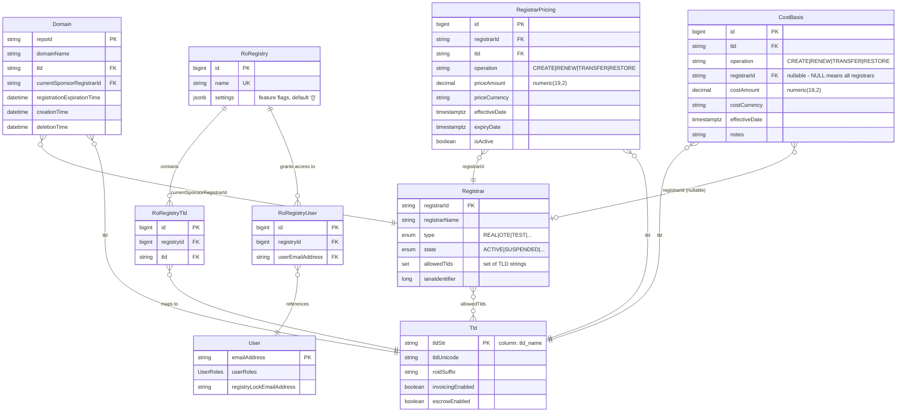
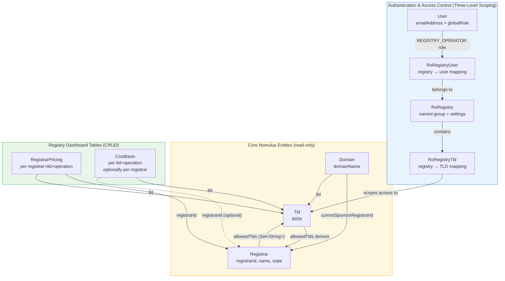
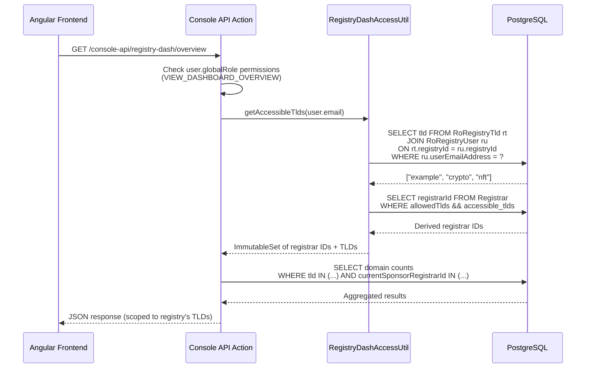
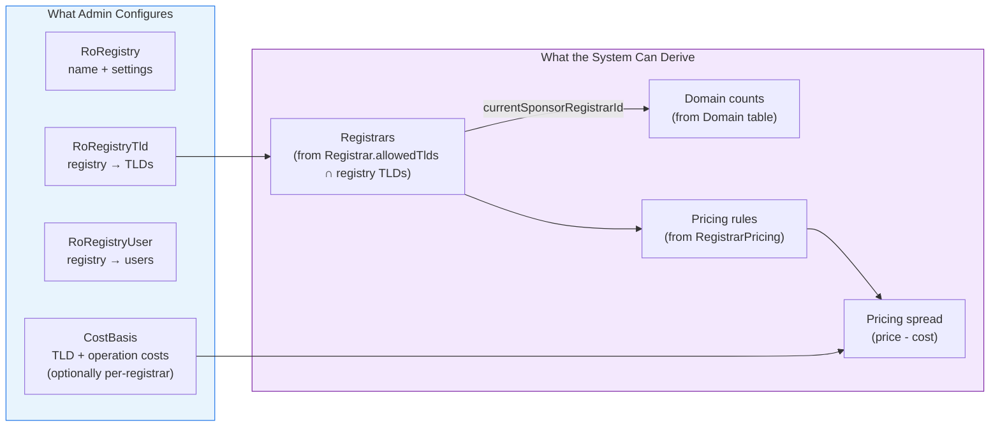
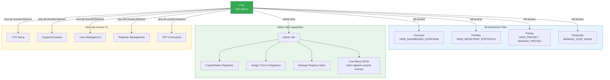

# Registry Dashboard - Data Model & Relationships

## Overview

The Registry Dashboard extends the Nomulus domain registry with operator-facing analytics, per-registrar pricing, financial tracking, and configuration. It introduces a **three-level scoping model** (Registry → TLDs → Users) that overlays the existing Nomulus data model to provide multi-tenant access control.

---

## Entity Relationship Diagram



---

## Data Flow Diagram



---

## Access Control Flow



---

## Three-Level Scoping Model

The scoping model replaces the old flat user-to-registrar mapping with a more intuitive registry-centric approach:

```
RoRegistry (named group, e.g., "registryXYZ")
├── RoRegistryTld → which TLDs belong to this registry
│   ├── "example"
│   ├── "crypto"
│   └── "nft"
└── RoRegistryUser → which users can see this registry's data
    ├── "alice@example.com"
    └── "bob@example.com"
```

**Access chain:** `User → RoRegistryUser → RoRegistry → RoRegistryTld → Tld → Registrar` (registrars derived via `allowedTlds`)

**Key benefit:** Adding a TLD to a registry instantly grants visibility to all registry users. No need to manage individual registrar mappings.

---

## Tables in Detail

### Existing Nomulus Tables (Read-Only)

| Table | Primary Key | Dashboard-Relevant Fields | Notes |
|-------|-------------|--------------------------|-------|
| `Tld` | `tld_name` (String) | `tld_name`, `tld_unicode`, `invoicing_enabled` | No registry operator field exists. Nomulus assumes single operator. |
| `Registrar` | `registrar_id` (String) | `registrar_id`, `registrar_name`, `type`, `state`, `allowed_tlds`, `iana_identifier` | `allowed_tlds` is the key relationship: maps registrar → TLDs |
| `Domain` | `repo_id` (String) | `domain_name`, `tld`, `current_sponsor_registrar_id`, `creation_time`, `deletion_time` | Links domain to both its TLD and sponsoring registrar |
| `User` | `email_address` (String) | `email_address`, `user_roles` (contains `globalRole` + `registrarRoles`) | `globalRole = REGISTRY_OPERATOR` for dashboard users |

### New Dashboard Tables (CRUD via API)

| Table | Primary Key | Unique Constraint | Purpose |
|-------|-------------|-------------------|---------|
| `RoRegistry` | `id` (bigserial) | `(name)` | Named registry group with JSONB settings |
| `RoRegistryTld` | `id` (bigserial) | `(registry_id, tld)` | Maps a registry to its TLDs |
| `RoRegistryUser` | `id` (bigserial) | `(registry_id, user_email_address)` | Maps a registry to its users |
| `RegistryDashboardRegistrarPricing` | `id` (bigserial) | `(registrar_id, tld, operation, effective_date)` | Per-registrar pricing overrides |
| `RegistryDashboardCostBasis` | `id` (bigserial) | `COALESCE(registrar_id, '') + tld + operation + effective_date` | Registry cost basis, optionally per-registrar |

### Schema Migrations

| Migration | Description |
|-----------|-------------|
| V221 | Initial pricing + cost basis + registrar mapping tables |
| V222 | TLD mapping table |
| V223 | Three-level refactor (RoRegistry, RoRegistryTld, RoRegistryUser) |
| V224 | Add `registrar_id` to CostBasis (nullable), add `settings` JSONB to RoRegistry |

---

## Key Relationships Explained

### 1. User → Registry → TLDs (Three-Level Scoping)

Access is controlled through the registry scoping chain:

```
User.emailAddress  →  RoRegistryUser.userEmailAddress
                       RoRegistryUser.registryId  →  RoRegistry.id
                                                      RoRegistry.id  →  RoRegistryTld.registryId
                                                                        RoRegistryTld.tld  →  Tld.tldStr
```

One user can belong to **multiple registries**. One registry can contain **many TLDs** and **many users**.

### 2. Registry → Registrars (Derived)

Registrars are **derived** from the TLD assignments, not directly mapped:

```
RoRegistryTld.tld = "example"
    → Registrar WHERE "example" IN (allowedTlds)
    → ["registrar1", "registrar2", "registrar3"]
```

### 3. Registrar → TLDs (via allowedTlds)

`Registrar.allowedTlds` is a `Set<String>` stored as a column (not a join table). It contains TLD strings that match `Tld.tldStr`.

### 4. Pricing: Registrar + TLD + Operation

Pricing rules are scoped to a specific registrar, TLD, and operation type:

```
RegistrarPricing.registrarId  →  Registrar.registrarId
RegistrarPricing.tld          →  Tld.tldStr
RegistrarPricing.operation    =  "CREATE" | "RENEW" | "TRANSFER" | "RESTORE"
```

### 5. Cost Basis: TLD + Operation + Optional Registrar

Cost basis can be scoped globally (NULL registrar_id = applies to all registrars) or per-registrar:

```
CostBasis.tld           →  Tld.tldStr
CostBasis.operation     =  "CREATE" | "RENEW" | "TRANSFER" | "RESTORE"
CostBasis.registrarId   →  Registrar.registrarId (nullable)
```

The unique constraint uses `COALESCE(registrar_id, '')` to ensure only one default rate per TLD/operation and one override per registrar/TLD/operation.

---

## Derived Relationships



| From | Derive | Query Pattern |
|------|--------|---------------|
| User email | Registry IDs | `SELECT registryId FROM RoRegistryUser WHERE userEmailAddress = ?` |
| Registry IDs | Accessible TLDs | `SELECT tld FROM RoRegistryTld WHERE registryId IN (...)` |
| TLDs | Registrar IDs | `SELECT registrarId FROM Registrar WHERE allowedTlds && accessible_tlds` |
| Registrar IDs | Domain counts | `SELECT COUNT(*), currentSponsorRegistrarId FROM Domain WHERE currentSponsorRegistrarId IN (...) GROUP BY ...` |
| Registrar + TLD | Pricing | `SELECT * FROM RegistrarPricing WHERE registrarId = ? AND tld = ? AND isActive = true` |
| TLD (+ optional registrar) | Cost basis | `SELECT * FROM CostBasis WHERE tld = ? AND (registrarId = ? OR registrarId IS NULL)` |
| Pricing - Cost | **Margin** | `pricing.priceAmount - costBasis.costAmount` (computed in UI) |

---

## Frontend Tabs

| Tab | Route | Component | Key Features |
|-----|-------|-----------|-------------|
| Overview | `/registry-dash/overview` | `OverviewComponent` | Summary cards, domain count by registrar |
| Portfolio | `/registry-dash/portfolio` | `PortfolioComponent` | Registrar list with details |
| Pricing | `/registry-dash/pricing` | `PricingComponent` | CRUD, sorting, filtering, default price comparison, diff column |
| Financials | `/registry-dash/financials` | `FinancialsComponent` | 3 sub-tabs: Cost Basis Rates (sorting + filtering), Summary by TLD, Pricing Spread (placeholder). Metric cards, stacked bar chart. |
| Admin | `/registry-dash/admin` | `AdminComponent` | Registry/TLD/user management, cost basis CRUD with registrar-scoped entries |

---

## Role & Permission Matrix

### No Dashboard Access (NONE, SUPPORT_AGENT, SUPPORT_LEAD)

These roles have **no visibility** into the Registry Dashboard. The nav item is hidden entirely.

- `NONE` users only see registrar-scoped views (Domains, Settings, Billing, etc.)
- `SUPPORT_AGENT` and `SUPPORT_LEAD` have broad operational permissions but the dashboard is not part of their workflow
- The `REGISTRY_DASH` element is added to `DISABLED_ELEMENTS_PER_ROLE` for all three roles

---

### Registry Operator Access (REGISTRY_OPERATOR)

Dashboard users who view and manage data **scoped to their registry's TLDs**.


**Data scoping:** All queries are filtered through `RegistryDashAccessUtil` which resolves user → registry → TLDs → registrars. An RO user only sees data within their registry's TLD assignments.

---

### Full Admin Access (FTE)

Full-time employees have **all dashboard permissions plus admin capabilities**.



**Key difference from REGISTRY_OPERATOR:** FTE users can see the Admin tab, which allows them to:
- **Create/delete** named registries (groups)
- **Assign TLDs** to registries (dropdown filtered by availability)
- **Manage users** within registries
- **CRUD cost basis** entries with optional registrar-scoped overrides

FTE users are **not scoped** by registry membership — they see all data across all registrars.

---

### Summary Table

| Permission | FTE | REGISTRY_OPERATOR | SUPPORT_LEAD | SUPPORT_AGENT | NONE |
|------------|:---:|:-----------------:|:------------:|:-------------:|:----:|
| VIEW_DASHBOARD_OVERVIEW | Y | Y | - | - | - |
| VIEW_REGISTRAR_PORTFOLIO | Y | Y | - | - | - |
| VIEW_PRICING | Y | Y | - | - | - |
| MANAGE_PRICING | Y | Y | - | - | - |
| MANAGE_COST_BASIS | Y | Y | - | - | - |
| Admin tab (manage registries/TLDs/users/cost basis) | Y | - | - | - | - |
| Dashboard nav visible | Y | Y | - | - | - |

---

## API Endpoints

| Method | Path | Action Class | Description |
|--------|------|-------------|-------------|
| GET | `/console-api/registry-dash/overview` | `RegistryDashOverviewAction` | Aggregate domain counts, registrar summary |
| GET | `/console-api/registry-dash/portfolio` | `RegistryDashPortfolioAction` | Registrar details, states, TLD assignments |
| GET, POST, PUT | `/console-api/registry-dash/pricing` | `RegistryDashPricingAction` | Pricing rules CRUD |
| GET, POST, PUT | `/console-api/registry-dash/cost-basis` | `RegistryDashCostBasisAction` | Cost basis CRUD (supports registrar-scoped entries) |
| GET, POST | `/console-api/registry-dash/admin` | `RegistryDashAdminAction` | Registry/TLD/user management |

---

## Important Design Notes

1. **Three-level scoping replaces flat mappings.** The old `RoRegistrarMapping` table was replaced in V223 with `RoRegistry` → `RoRegistryTld` + `RoRegistryUser`. This is more intuitive: assign TLDs to a registry, assign users to a registry, and registrars are derived automatically.

2. **No multi-operator support in Nomulus core.** The `Tld` entity has no `registryOperator` field. Nomulus assumes a single entity operates all TLDs. The `RoRegistry` scoping model bridges this gap.

3. **`allowedTlds` is not a join table.** It's a `Set<String>` stored directly on the `Registrar` entity. Registrars are derived from TLD assignments, not mapped directly.

4. **Soft references, not foreign keys.** The dashboard tables use `registrarId` and `tld` as string columns, not as database-level foreign keys to `Registrar` and `Tld` tables. This follows the Nomulus convention of loose coupling.

5. **Cost basis: global vs per-registrar.** A cost basis entry with `registrar_id = NULL` is the default rate for that TLD/operation. An entry with a specific `registrar_id` is an override for that registrar. The COALESCE-based unique index enforces at most one default and one override per registrar.

6. **RoRegistry.settings is JSONB.** The `settings` column stores feature flags and configuration as a JSON object (e.g., enabling/disabling pricing spread visibility). Default is `'{}'`.

7. **Upstream compatibility.** All dashboard-specific files are UD-only (prefixed or in UD-specific directories). Schema migrations V221-V224 are additive. Merge conflict risk with upstream `google/nomulus` is minimal.
