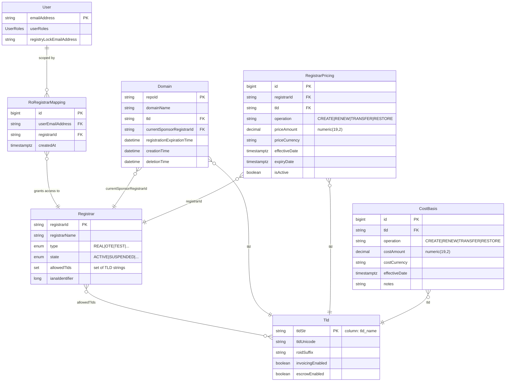
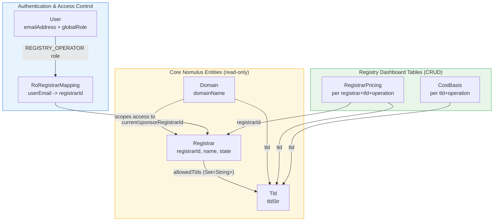
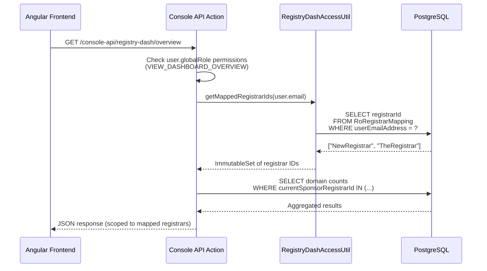
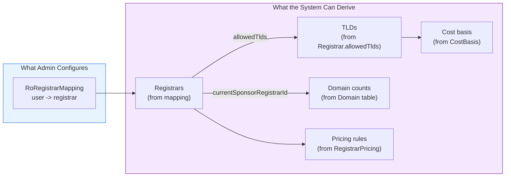
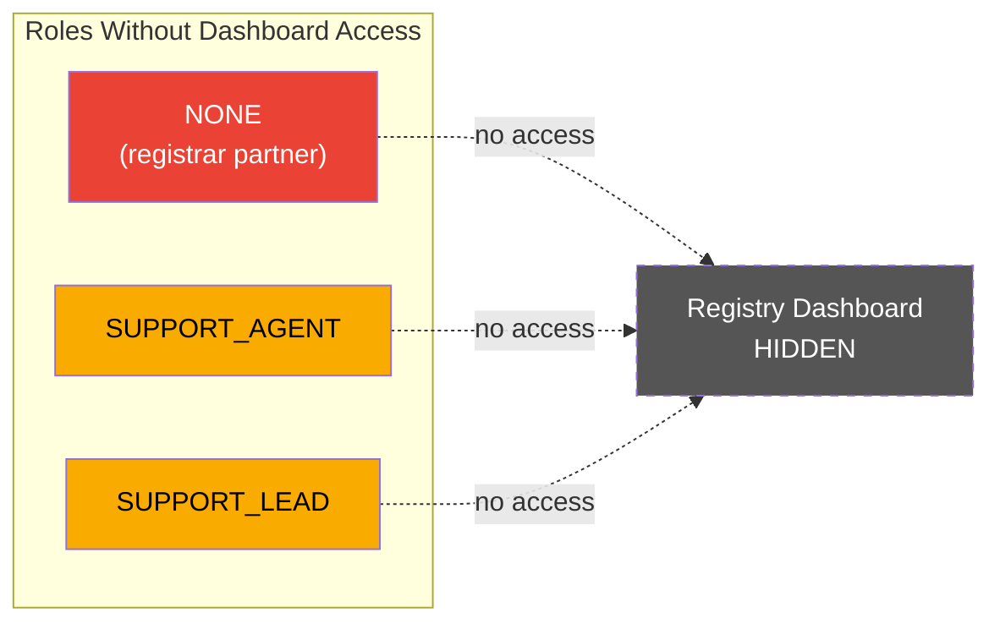
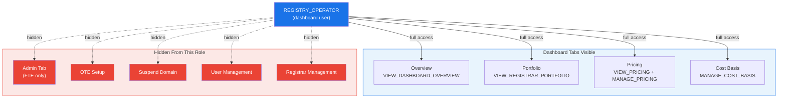
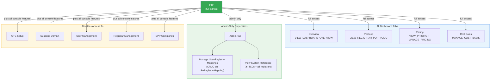

# Registry Dashboard - Data Model & Relationships

## Overview

The Registry Dashboard extends the Nomulus domain registry with operator-facing analytics and configuration. It introduces 3 new tables that overlay the existing Nomulus data model to provide access control, per-registrar pricing, and cost tracking.

---

## Entity Relationship Diagram



---

## Data Flow Diagram



---

## Access Control Flow



---

## Tables in Detail

### Existing Nomulus Tables (Read-Only)

| Table | Primary Key | Dashboard-Relevant Fields | Notes |
|-------|-------------|--------------------------|-------|
| `Tld` | `tld_name` (String) | `tld_name`, `tld_unicode`, `invoicing_enabled` | No registry operator field exists. Nomulus assumes single operator. |
| `Registrar` | `registrar_id` (String) | `registrar_id`, `registrar_name`, `type`, `state`, `allowed_tlds`, `iana_identifier` | `allowed_tlds` is the key relationship: maps registrar -> TLDs |
| `Domain` | `repo_id` (String) | `domain_name`, `tld`, `current_sponsor_registrar_id`, `creation_time`, `deletion_time` | Links domain to both its TLD and sponsoring registrar |
| `User` | `email_address` (String) | `email_address`, `user_roles` (contains `globalRole` + `registrarRoles`) | `globalRole = REGISTRY_OPERATOR` for dashboard users |

### New Dashboard Tables (CRUD via API)

| Table | Primary Key | Unique Constraint | Purpose |
|-------|-------------|-------------------|---------|
| `RegistryDashboardRoRegistrarMapping` | `id` (bigserial) | `(user_email_address, registrar_id)` | Maps RO users to registrars they can view |
| `RegistryDashboardRegistrarPricing` | `id` (bigserial) | `(registrar_id, tld, operation, effective_date)` | Per-registrar pricing overrides |
| `RegistryDashboardCostBasis` | `id` (bigserial) | `(tld, operation, effective_date)` | Registry cost basis per TLD/operation |

---

## Key Relationships Explained

### 1. User -> Registrars (via RoRegistrarMapping)

There is **no direct FK** between `User` and `Registrar`. Access is controlled through `RegistryDashboardRoRegistrarMapping`:

```
User.emailAddress  --->  RoRegistrarMapping.userEmailAddress
                         RoRegistrarMapping.registrarId  --->  Registrar.registrarId
```

One user can be mapped to **many registrars**. One registrar can be viewed by **many users**.

### 2. Registrar -> TLDs (via allowedTlds)

`Registrar.allowedTlds` is a `Set<String>` stored as a column (not a join table). It contains TLD strings that match `Tld.tldStr`.

```
Registrar.allowedTlds = {"example", "tld", "xn--q9jyb4c"}
                                 |
                                 v
                         Tld.tld_name = "example"
                         Tld.tld_name = "tld"
                         Tld.tld_name = "xn--q9jyb4c"
```

### 3. Domain -> Registrar + TLD

Every domain links to exactly one registrar and one TLD:

```
Domain.currentSponsorRegistrarId  --->  Registrar.registrarId
Domain.tld                        --->  Tld.tldStr
```

### 4. Pricing: Registrar + TLD + Operation

Pricing rules are scoped to a specific registrar, TLD, and operation type:

```
RegistrarPricing.registrarId  --->  Registrar.registrarId
RegistrarPricing.tld          --->  Tld.tldStr
RegistrarPricing.operation    =     "CREATE" | "RENEW" | "TRANSFER" | "RESTORE"
```

### 5. Cost Basis: TLD + Operation

Cost basis is scoped to a TLD and operation (not per-registrar, since cost is the same regardless of registrar):

```
CostBasis.tld        --->  Tld.tldStr
CostBasis.operation  =     "CREATE" | "RENEW" | "TRANSFER" | "RESTORE"
```

---

## Derived Relationships

The dashboard can derive several useful views from the existing data:



| From | Derive | Query Pattern |
|------|--------|---------------|
| User email | Mapped registrar IDs | `SELECT registrarId FROM RoRegistrarMapping WHERE userEmailAddress = ?` |
| Registrar IDs | Registrar details | `SELECT * FROM Registrar WHERE registrarId IN (...)` |
| Registrar IDs | Relevant TLDs | `SELECT DISTINCT allowedTlds FROM Registrar WHERE registrarId IN (...)` |
| Registrar IDs | Domain counts | `SELECT COUNT(*), currentSponsorRegistrarId FROM Domain WHERE currentSponsorRegistrarId IN (...) GROUP BY currentSponsorRegistrarId` |
| Registrar + TLD | Pricing | `SELECT * FROM RegistrarPricing WHERE registrarId = ? AND tld = ? AND isActive = true` |
| TLD | Cost basis | `SELECT * FROM CostBasis WHERE tld = ?` |
| Pricing - Cost | **Margin** | `pricing.priceAmount - costBasis.costAmount` (computed in UI) |

---

## Role & Permission Matrix

### No Dashboard Access (NONE, SUPPORT_AGENT, SUPPORT_LEAD)

These roles have **no visibility** into the Registry Dashboard. The nav item is hidden entirely.



- `NONE` users only see registrar-scoped views (Domains, Settings, Billing, etc.)
- `SUPPORT_AGENT` and `SUPPORT_LEAD` have broad operational permissions but the dashboard is not part of their workflow
- The `REGISTRY_DASH` element is added to `DISABLED_ELEMENTS_PER_ROLE` for all three roles

---

### Registry Operator Access (REGISTRY_OPERATOR)

Dashboard users who view and manage data **scoped to their mapped registrars**.



**Data scoping:** All queries are filtered through `RegistryDashAccessUtil.getMappedRegistrarIds(user.email)`. An RO user only sees registrars they've been mapped to via the Admin panel.

| Permission | Access | Used By |
|------------|--------|---------|
| VIEW_DASHBOARD_OVERVIEW | Read | Overview tab - aggregate domain counts, registrar summary |
| VIEW_REGISTRAR_PORTFOLIO | Read | Portfolio tab - registrar details, states, TLD assignments |
| VIEW_PRICING | Read | Pricing tab - view per-registrar pricing rules |
| MANAGE_PRICING | Write | Pricing tab - create/edit pricing rules |
| MANAGE_COST_BASIS | Write | Cost Basis tab - create/edit cost basis entries |

---

### Full Admin Access (FTE)

Full-time employees have **all dashboard permissions plus admin capabilities**.



**Key difference from REGISTRY_OPERATOR:** FTE users can see the Admin tab, which allows them to:
- **Create** user-to-registrar mappings (grant RO users access)
- **Delete** existing mappings (revoke access)
- **View** all TLDs and registrars in the system as reference data

FTE users are **not scoped** by `RoRegistrarMapping` — they see all data across all registrars.

---

### Summary Table

| Permission | FTE | REGISTRY_OPERATOR | SUPPORT_LEAD | SUPPORT_AGENT | NONE |
|------------|:---:|:-----------------:|:------------:|:-------------:|:----:|
| VIEW_DASHBOARD_OVERVIEW | Y | Y | - | - | - |
| VIEW_REGISTRAR_PORTFOLIO | Y | Y | - | - | - |
| VIEW_PRICING | Y | Y | - | - | - |
| MANAGE_PRICING | Y | Y | - | - | - |
| MANAGE_COST_BASIS | Y | Y | - | - | - |
| Admin tab (manage mappings) | Y | - | - | - | - |
| Dashboard nav visible | Y | Y | - | - | - |

---

## Important Design Notes

1. **No multi-operator support in Nomulus core.** The `Tld` entity has no `registryOperator` field. Nomulus assumes a single entity operates all TLDs. The `RoRegistrarMapping` table bridges this gap by scoping dashboard access per user.

2. **`allowedTlds` is not a join table.** It's a `Set<String>` stored directly on the `Registrar` entity. This means there's no separate `Registrar_Tld` mapping table to query.

3. **Soft references, not foreign keys.** The dashboard tables use `registrarId` and `tld` as string columns, not as database-level foreign keys to `Registrar` and `Tld` tables. This follows the Nomulus convention of loose coupling.

4. **Pricing vs. Cost Basis scope.** Pricing is per-registrar (each registrar can have different prices). Cost basis is per-TLD (the registry's cost is the same regardless of which registrar originates the domain).

5. **Future consideration: TLD-based scoping.** Instead of mapping users to registrars directly, mapping users to TLDs would be more intuitive (`Registry -> TLDs -> Registrars`). From a TLD mapping, registrars can be derived via `Registrar.allowedTlds`. This would reduce admin overhead (5 TLD mappings vs 50+ registrar mappings).
